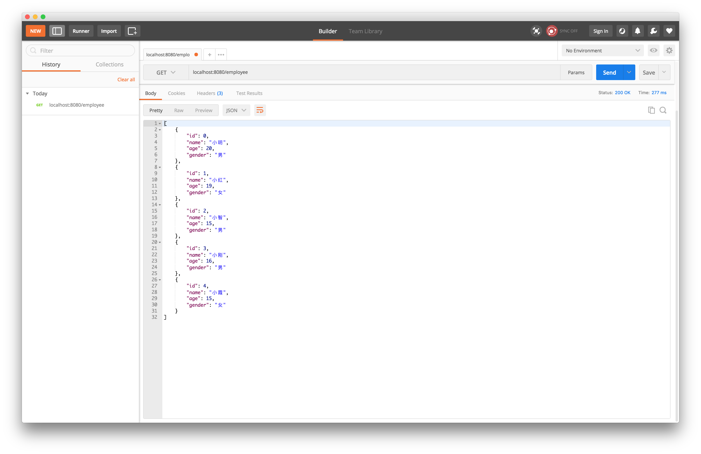

# Spring MVC基础

## 练习描述
- 在上次Employee API的基础上，利用 get 接口获取的数据完成一张table
- 使用 jsp 来渲染页面

## 环境描述 
- java8
- spring-boot
- Intellij-IDEA

## 如何开始
- 在命令行中使用以下命令在用户本地任意目录下clone此题目库
```
git clone repo_of_this_template
```
- 使用`./gradlew bootRun`来启动服务器

## 输出规范
- 用jsp 完成如下页面


- 项目根目录下必须包含运行截图`result.png`
    
## 题目要求
- 代码通过小步提交，并且每次提交的描述都要有意义
- 使用快捷键编码
