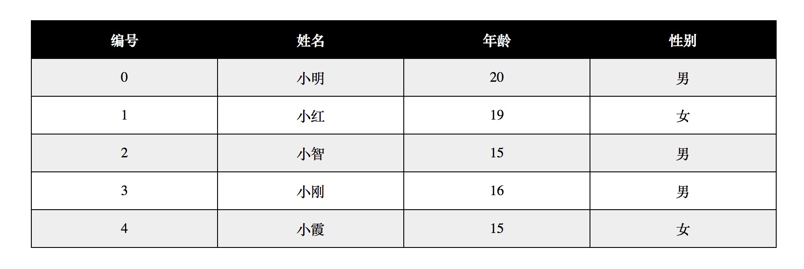

# Employee demo

## 练习描述
- 在上次Employee API的基础上，利用get 接口获取的数据完成一张table
- 使用jsp 来渲染页面

## 环境描述 
- java8
- spring-boot
- Intellij-IDEA

## 如何开始
- 使用如下方式建立Spring boot项目
  - 从`http://start.spring.io/`生成一个项目包，并下载下来，解压，开始编码
- 使用`./gradlew bootRun`来启动服务器

## 输出规范
- 仔细阅读上面的练习描述，完成作业
- 运行项目，启动服务器
- 用jsp 完成页面，页面如下图所示：

- 截图，并将图片存放在项目根目录下，截图命名为`result.png`
    
## 题目要求
- 代码通过小步提交，并且每次提交的描述都要有意义
- 使用快捷键编码
